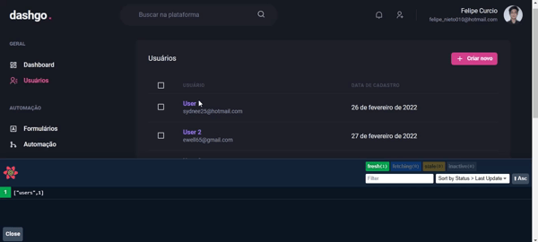

# Dashgo

> Projeto estudado durante o Ignite da Rocketseat sobre Data fetching e Cache local

## React-Query

React Query é utilizado para buscar dados, sua diferença entre usar o axios ou o fetch, da própria API do Javascript, é que além de possuir hooks específicos para ser usado no React, ele é capaz de armazenar dados em cache, de forma que não seja necessário fazer as mesmas requisições HTTP em um curto intervalo de tempo. No GIF abaixo, note que a primeira requisição de usuários há um estado de carregamento, após buscar os usuários eles são armazenados em cache e o estado de carregamento não ocorre novamente:

React Query usa a estratégia "stale while revalidate" (SWR), ou seja, caso o cache não seja mais válido, a biblioteca irá apresentar os dados em cache antigos na interface e por baixo dos panos irá revalidar esses dados fazendo uma nova requisição, para que os dados velhos (stale data) que estão em cache sejam atualizados, e os dados revalidados sejam exibidos.

A biblioteca traz uma série de funcionalidades como "revalidade on focus", que ocorre quando usuário troca de janela e ao voltar para aplicação os dados são revalidados; "prefetching", no qual realiza a busca de dados e armazena em cache, antes mesmo de renderizar os componentes que usam esses dados; "mutations", usado quando são efetuadas operações que geram side-effects no server, ou seja, ao atualizar, deletar ou criar algum dado. É possível customizar diversos parâmetros, como por exemplo indicar por quanto tempo um cache local deve ser considerado válido.

### Prefetching

Com o React Query é possível realizar o prefetch de dados a partir de um evento disparado, nesse caso é feito o prefetch quando o usuário passa o mouse em cima da próxima página de usuários.

Adicionei a funcionalidade de editar um usuário, ao passar o mouse em cima do usuário a ser editado é realizado o prefetch dos dados do usuário prestes a ser editado, dessa forma, uma vez que o usuário clica para editar, os dados já foram buscados e são renderizados pelo componente:

## MirageJs - mock API

Essa aplicação faz uso do MirageJs para simultar uma REST API.
